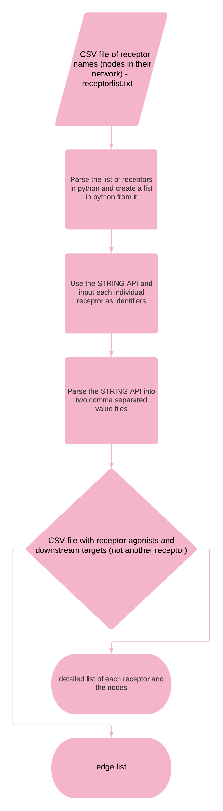

# STRING Database Pipeline #

## Design Doc ##

### Overview ###

  The Kekenes-Huskey Lab has a pipeline called “PathwayAnalysis”. Our project is to integrate another step in the already existing pipeline. The goal of this project is to build a pipeline that takes as an input a list of receptors and outputs the activators and the downstream targets found within the STRING database. 
  
### Context ###

  This is necessary for this lab because it would significantly reduce the time that it takes to manually curate through the STRING database to find the activators of one receptor and the downstream targets for that specific receptor. The pipeline would also be able to take multiple receptors, such as a list of receptors, and output a comma separated value file which can be imputed in cytoscape to create a diagram of the connections. 
  
### Goals ##
  Create a pipeline which takes a receptor list as the input and outputs an edge list containing the activators and the downstream target of that receptor.
Pipeline should also output a second csv file with information such as the downregulation or upregulation of the proteins within the network
The pipeline should have a flag for human or mouse proteins

### Non-Goals ### 
  We met with Dr. Kekenes-Huskey and discussed that we will only change the tab delimited files to csv only to the files we are working on and not his whole pipeline. 
  
### Proposed solution ###

### Milestone ###

|                    |                                                                            |                                                                            |                                                                            |
|--------------------|----------------------------------------------------------------------------|----------------------------------------------------------------------------|----------------------------------------------------------------------------|
|                    | Adriana                                                                    | Maryann                                                                    | Abdullah                                                                   |
| March 14 (Week 9)  | Complete design doc                                                        | Complete design doc                                                        | Help with design doc                                                       |
|                    | Meet with Dr. Kekenes-Huskey to retrieve sample data                       | Meet with Dr. Kekenes-Huskey to retrieve sample data                       | Meet with Dr. Kekenes-Huskey to retrieve sample data                       |
| March 21 (Week 10) | Using receptor list create list in python and parse it into the STRING API | Using receptor list create list in python and parse it into the STRING API | Test code                                                                  |
| March 28 (Week 11) | Use the .SIF files to get information about the nodes                      | Test code                                                                  | Using the receptor nodes find the antagonists                              |
| April 4 (Week 12)  | Parse the output from String                                               | Using the antagonists found make sure they are not repetitive              | Test code                                                                  |
| April 11 (Week 13) | Test code                                                                  | Using the receptor nodes find the antagonists                              | Using receptor list create list in python and parse it into the STRING API |
| April 18 (Week 14) | Debug                                                                      | Test code                                                                  | Debug                                                                      |
| April 25 (Week 15) | Test code                                                                  | Create final presentation                                                  | Create final presentation                                                  |
|                    |

